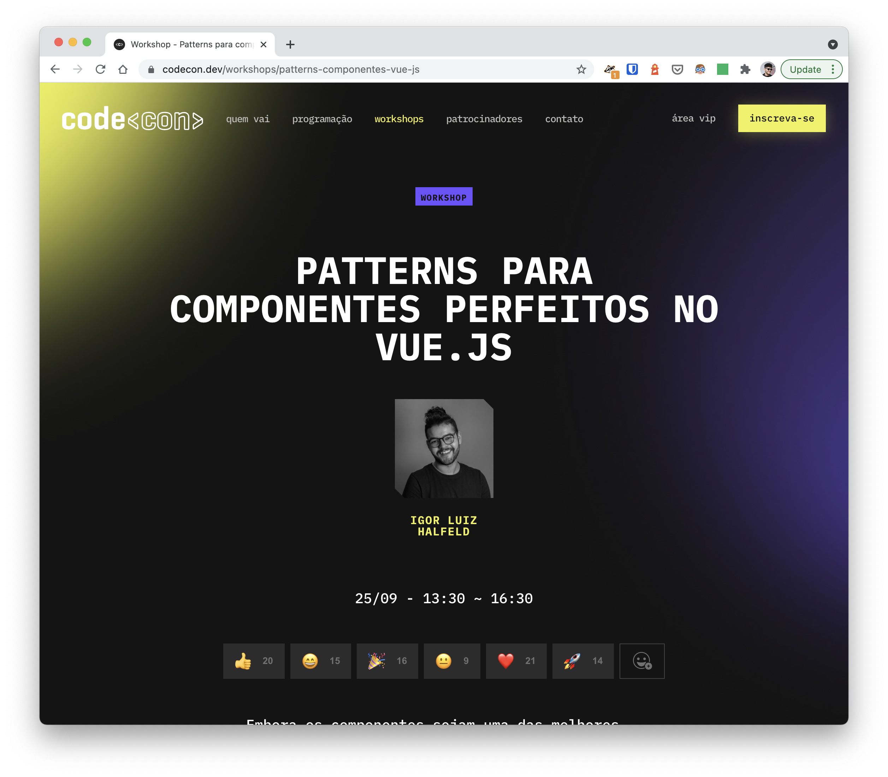

## `codecon-vuejs-components-patterns-workshop`

> Workshop para a [codecon](https://codecon.dev/workshops/patterns-componentes-vue-js)

Embora os componentes sejam uma das melhores coisas que já aconteceram no front-end, a capacidade de reutilização e a escalabilidade tornam-se as coisas mais difíceis de gerenciar conforme sua base de código e equipe crescem. Aqui vou mostrar os padrões de componentes você precisa considerar para reutilização e escalabilidade do código.

